# Building resilience in cybersecurity: An artificial lab approach

> Title : Building resilience in cybersecurity : An artificial lab approach
>
> Authors : Kerstin Awiszus, Yannick Bell, Jan Lüttringhaus, Gregor Svindland, Alexander Voß, Stefan Weber
>
> Journal : Journal of Risk and Insurance 2023
>
> Summary : Data twin
>
> - Purpose : 
> - How : 
> - Contribution of this paper : 

#### 용어 정리

- Digital Twin : 객체가 있고, 그 객체에 대한 가상의 객체를 만들어서 두 객체를 데이터로 연결하는 것.
- Lab : 

### 1. Introduction

사이버 리스크의 영향력은 현재 증가하는 중이며, potentially **catastrophic consequences of cyber risk**는 주목할만한 이슈임.

- systemic relevance of certain types of cyber threats is highlighted.

- Systemic cyber risk에는 대표적인 두 사례가 있음:
  - WannaCry: 이 회사가 150개국의 230,000개의 컴퓨터 랜섬웨어로 감염시킴. 이때 데이터 암호화했는데, 이로 인해 data loss, IT 시스템을 사용할 수 없게 되면서 damage발생. 
  - NotPetya: 우크라이나에 NotPetya malware가 발생함. 이로 인해 데이터 암호화되고 IT서비스가 교란됨. 이로 인해 은행과 주식시장에 손해가 영향이 가서 영구적인 손실이 발생하게 됨. 

본 논문에서는 연결되어 있는 시스템 내에서 발생하여 전염이 되는 systemic cyber risk에 대해 연구하였음.

- 하지만 사이버 위협은 빠르게 성장하고 있기 때문에 모든 attack을 막는 것은 사실상 불가능함.
  - therefore, building cyber resilience requires taking **a more expansive approach.**
- 다양한 법적인 제도도 마련이 되었지만, 이러한 노력은 사이버 위협에 대한 적절한 수준의 보호나 사이버 회복력에 대한 적절한 측정을 할 수는 없음. 

본 논문에서는 아래 4가지 contributions을 가지고 있음.

- 첫 번째 contribution : 사이버 시스템 내 디지털 트윈방식인 artificial cyber lab을 디자인하였음.
  - Digital twins consist of a "physical entity, a virtual counterpart, and the data links between them."
- 두 번째 contribution : 사이버 회복력 분석을 위한 실제 세계의 virtual counterpart로부터 인공적인 데이터 생성하는 lab 활용
  - Security-related interventions : 사이버 네트워크 내 상호연결된 요소들은 안전을 위한 투자를 한다.
  - Topology-based interventions : 네트워크의 위상의 중요성... 이와 관련된 연구 진행
- 세 번째 contribution : 사례들에 대한 연구를 바탕으로, 실제 사이버 시스템 네트워크 내에서 사용되거나, 사용 논의되고 있는 선별된 규제 측정모형들을 논의하였음.
- 네 번째 contribution : 현재 유럽과 미국내 사이버 안전 분야에서 사용 중인 규제모형을 다루었으며, 사이버 보험 기업과 같은 private actor들의 역할에 대해 다루었음.

#### 1.2 Outline

본 논문의 구조

- Section 2: 유럽과 미국에서 사용되고 있는 현재 사이버안전과 관련된 법적 규제에 대한 설명 및 보험회사들의 법적 역할 언급.
  - 추가로, 사이버 안전을 강화할 수 있는 접근법 또한 설명
- Section 3: 인공 사이버 랩에 대한 소개
- Section 4~5 : 안전/구조 측면에서 사이버 회복력 측정 분석에 대한 사례 연구 수행
  - 이러한 수행들을 바탕으로, Section 2에서 설명한 접근법 다시 설명
- Section 6 : 결론

### 2. The Real Word : The Current state of Cybersecurity Regulation

이 챕터에서는 아래 두 가지를 다룰 것임.

- 현재 통용되고 있는 사이버안전 관련 법률의 주요 특징
- 사이버안전을 다루는 보험회사(private actors)들의 역할

#### 2.1 Current government regulations for cybersecurity

정책 입인자들은 중립적인 법률 용어를 사용함.

- 왜냐하면 정적이지 않다는 사이버 영역의 본질 때문임.
  - 대표적인 중립적인 법률 용어는 "adequate security measures", "adequate technical and organizational measures"

- 이로 인해 올바른 사이버안전 측정에 대한 불확실성을 가져오게 됨.
- 최근들어 기관에서 제정하는 기술 관련 기준 및 가이드라인이 점점 늘고 있는데, 이러한 기준들은 아래의 문제점이 있으며, 이러한 문제들로 인해 위 기준들을 실행하는 것이 어려움.
  - 먼저, 민간 기업들은 법적 구속력이 없음. 즉 이런 가이드라인을 내놓는다 하더라도 민간기업들에게 강요하지 못함. (binding nature)
  - 민간기업들은 상당히 복잡하다는 특징이 있음. (complexity)

다음은 유럽과 미국에서 사용되고 있는 사이버안전 법률이다.

- 먼저 중요한 인프라에 대한 보호 관련 법령
  - 유럽에서는 사이버 안전을 위한 최소한의 기준을 설정해놓음.
    - 하지만 구체적이지는 않음.
  - 미국에서는 

#### 2.2 Regulations by private actors and the role of insurance companies

사이버 보험은 기업들이 사이버리스크를 잘 관리하고 적절한 사이버 측정방식을 찾을 수 있게 하는 효율적인 방법이다.

- 사이버 안전 분야에는 중립적 용어 사용으로 인한 취약점이 존재하며, 이러한 법률들이 기업들을 통제하기에 충분치 못함.
- 보험회사와 금융기관에게 사이버 안전은 매우 중요함.
  - 그들이 지는 사회 내 중요도와 그들이 지니고 있는 민감한 데이터 때문
  - 또한 미국 은행 및 보험 산업 내에서 점점 더 관련성이 높아지고 있음.
- 따라서 본 논문에서는 사이버보험 회사들이 보험계약자들에게 사이버안전 표준을 촉진시킬 수 있는 특정 역할에 중점을 둠.
  - 사이버 보험은 기업들에게 매우 도움이 되는 방법이기 때문에, 보험회사들은 특정 기준을 설정함으로써 사이버 안전과 사이버 회복을 촉진시킬 수 있음.

#### 2.3 Selected measures of cyber resilience

### 3. The Artificial Cyber Lab - The Digital Twin of a Complex Cyber System

사이버리스크와 관련된 데이터는 상당히 희소하며, 비정적 (non-stationary)하다는 특징이 있음 (due to the rapidly evolving IT-infrastructure)

- 이는 전통적인 통계 및 계리모형에는 적합하지 않음.
  - 이는 빈도 심도 접근이며 충분한 데이터가 필요하기 때문
- 따라서 전통적인 방식으로는 cyber resilience intervention 관찰이 적합하지 않음.
- **따라서 본 논문에서는 artificial cyber lab을 도입함**. 

Network models for cyber risk contagion consist of three key components:

- 상호작용을 표현하는 **네트워크**
- 상호작용 채널을 통해 진화하는 특정 cyber threat의 확산을 설명하는 **모델**
- cyber threat 확산으로 인해 여러 에이전트에서 발생하는 손실을 설명하는 **손실 모델**

#### 3.1 Network

내부연결된 agent들의 시스템은 네트워크로 표현이 가능하다.

- agent는 노드로, interaction channel은 엣지로 표현함.
- 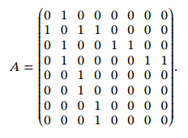
- 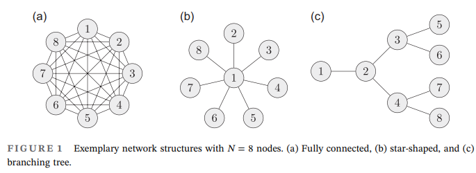

#### 3.1.1 Random network models

We consider the following two standard classes of undirected random networks.

- **Erdős–Rényi networks**
  - 네트워크 내 모든 엣지가 다 같은 확률 p로 나타남.
- **Barabási–Albert networks**
  - perferential attachment principal을 따름. more heterogeneous.
  - 새로 생성되는 노드는 엣지가 많이 연결된 인기많은 노드에 연결될 가능성이 높음.
  - few nodes of high degree, and a vast majority of less connected nodes. (observable hierarchy)

#### 3.1.2 Measuring centrality

Centrality measure C는 네트워크 내 단일 노드/엣지의 구조적 중요도(기여도)를 표현하는 지표다.

- 엣지 e에 대한 중요도
  - $\mathcal{C}^{\textbf{edge}}(e) = \Sigma_{i,j} \frac{\sigma_{ij}(e)}{\sigma_{ij}}$
  - $\sigma_{ij}$ : 노드 i와 노드 j 간의 가장 짧은 edge
  - $\sigma_{ij}(e)$ : e를 통해 지나가는 길들의 전체 개수
- 노드 i에 대한 중요도
  - Degree Centrality : $\mathcal{C}^{\textbf{deg}}(i) = \Sigma_{j=1}^{N} a_{ij}$
    - 나에게 엣지가 몇개나 달려있는지로 측정하는 centrality, 좀 naive하다는 특징이 있다.
  - Betweenness Centrality : $\mathcal{C}^{\textbf{bet}}(i) = \Sigma_{j,h}\frac{\sigma_{jh}(i)}{\sigma_{jh}}$
    - 경유의 중심에 속하는지 보는 기법. 
    - 즉 교차로를 노드, 길을 링크로 본다면 가장 교통의 중심이 되는 없어서는 안될 노드일수록 betweenness centrality가 높다고 할 수 있다. 서울의 양재.
    - 연결 측면에서의 노드의 역할을 중요시 여김

#### 3.2 Modeling contagious cyber risks

네트워크 내 여러 채널들을 통해서 contagious cyber risk가 확산된다.

- agent 집합을 시간에 따른 카테고리로 구별하였으며, 다음과 같이 구분지음.
  - infection, infected, recovered
- SIS, SIR 총 2개의 마코브 모델을 사용하였음.
  - SIS Framework : 재감염된 객체가 등장할 수 있음.
  - SIR Framework : 재감염된 객체는 없고, 한번 회복되면 영원히 recovered individual로 인식함.
- 2개의 파라미터 사용 : infection rate ($\tau$), recovery rate ($\gamma$)
- 

#### 3.3 Cyber loss models

모델링의 목적에 따라 네트워크의 역할이 달라짐.

- 감염된 구성 성분의 전체 개수에 주목할 수 있음.
- 네트워크 전체 총 손실 집계에 주목할 수 있으며, 혹은 단일 노드에서 발생한 금전적 손실만 관찰할 수 있음.

적절한 모델은 아래의 조건을 만족해야 함.

- 위험 시나리오에 대한 확률적 특성 반영할 수 있어야 함.
- loss 기댓값과 꼬리 위험도를 고려하여 사이버 손실 분포의 주요 통계적 특징들 추출 가능해야함.

#### 3.4 Artificial cyber lab setup

본 논문에서 사용할 artificial cyber lab은 아래의 조건들을 만족함.

- 우선 **SIR 모델**을 사용 : 재감염 이슈는 고려하지 않을 것.
- 네트워크의 구조 (입력값, 출력값)는 다음과 같음.
  - 
- 본 연구에서의 lab은 (1) 가상의 모델 (counterpart)로부터 artificial data를 생성할 것이며, (2) 실체 모델과 가상의 모델 간의 cyber resilience intervention을 비교하여 평가할 것임.
- 이를 통해 실제 사이버 시스템을 위한 구체적인 cyber resilience의 구현에 대한 시사점을 논의할 예정임.

### 4. Case Study 1 : Security-related Interventions under Strategic Interaction

4장에서는 인공 cyber lab 프레임워크 내에서 보안수준, 이점 및 비용에 적합한 모델을 소개함.

- 하지만 객체들 간의 interconnectedness는 매우 중요한 이슈임.
- 따라서 security investment game을 통해 interdependence effects within the cyber network를 연구하고자 한다.
- finally, we evaluate if, and how, security-related interventions in the form of additional security obligations can efficiently be allocated among network nodes to improve the overall safety of the cyber system.

#### 4.1 Security investments and strategic interaction

SIR 프레임워크를 따르는 cyber risk exposure of network의 파라미터는 다음과 같이 설정

- infection rate ($\tau$) : 0.1로 고정
- recovery rate ($\gamma$) : 변동, 이 섹션에서는 security level로 해석할 것.
  - $\gamma_i$ 가 감소할 수록, 기업 $i$가 감염여부를 확인하는데 걸리는 시간이 늘어남.

Security level인 $\gamma_i$는 두개의 함수 간 trade-off로 결정됨 : loss function & cost function

- 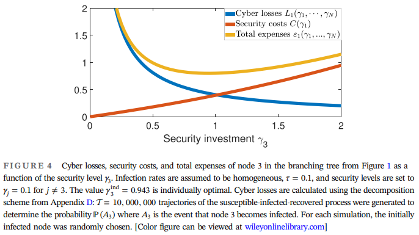
- Cyber loss function : $L_i := L_i(\gamma_1, .., \gamma_N) := E[\int_{0}^{\infin} I_i(t) dt]$
  - 네트워크 에이전트의 상호연결성으로 인한 모든 노드 보안수준의 함수로, 특정 노드 $i$에서의 손실값 설명.
  - Cyber 손실의 양은 cyberattack을 당하는 기간과 관련있음.
  - security level이 $\gamma_1,..,\gamma_N$일 때, 특정 노드 $i$가 감염상태 $I$에 머무는 예상시간을 나타냄.
- Cost function : $C_i(\gamma_i)$
  - **특정 노드 $i$가 보안수준 $\gamma_i$를 구현하는데 드는 비용**
  - $C(\gamma_i)$는 지수함수로 표현 : $C(\gamma_i) = e^{k \gamma_i}-1, k>0$ (주로 $k$는 ${1}/{3}$으로 설정)
    - convex함수 (target의 보안수준이 증가할 수록 cost는 더 빠르게 증가하므로)
    - $C(0)=0$

- 이상적인 네트워크의 목적함수는 다음과 같음.
  - $\underset{\gamma}{\textbf{min}} \ \mathcal{E}_i(\gamma_1, .., \gamma_N) = \underset{\gamma}{\textbf{min}} \ C_i(\gamma_i)+L_i(\gamma_1, .., \gamma_N)$
  - $\tau$=0.1로 고정, time은 $t=0$으로 설정, 노드는 랜덤으로 설정

#### 4.1.1 Individually optimal security level

만약 보안수준 $\gamma_i$가 총 비용 $\mathcal{E}_i()$를 최소화한다면, 이 보안수준은 개별적으로 optimal security level임.

- rational한 agent는 아래 식을 따르는 최적의 security level을 선택해야 함.
- $\gamma_i^{\text{ind}}(\gamma_{-i}) := \underset{\gamma_i \in \{0, \infin)}{\text{argmin}}\ \mathcal{E}(\gamma_1, ..., \gamma_N)$

#### 4.1.2 Strategic interaction of interdependent actors

네트워크 내의 노드들은 서로 연결되어있음.

- 네트워크 노드의 보안수준 선택은 다른 노드의 사이버 손실에도 영향을 미침.
- 따라서 이러한 노드는 차례로 새로운 위협상황에 대응하여 일련의 전략적 상호작용을 시작함.
- 이러한 상호작용을 security investment game이라고 함.

steady state란?

- 개별적으로 최적의 보안수준이 유지되는 상태
- $\gamma_i^{\text{ind}}(\gamma_{-i})=\gamma_i$
- security investment game의 내쉬균형
- 정리 4.1과 4.2는 개별적으로 최적화된 보안 수준의 정상상태의 존재를 증명함.

>  **Theorem 4.1 : Steady states of individually optimal security levels exist.**
>
> 총 지출 $\mathcal{E}_i$는 $\gamma_i$에 대해 convex하며, 최저점을 가진다.
>
> - 이 game은 여러 라운드 $r=0,1,..,M$ 로 구성된 동적 게임으로 구현됨.
> - 모든 라운드 r에서 보안수준은 아래와 같은 고정벡터로 시작함.
>   - $\gamma(r) = (\gamma_1(r),\gamma_2(r),,..,\gamma_N(r))$

> Algorithm 4.2 : The security investment game**
>
> - 모든 노드 $i$에 대해 적절한 security level을 설정. 
>   - 초기 security level은 $\gamma(0)\in (0,\infin)^N$로 설정하며, 몇 라운드로 진행할지도 결정함.
> - 라운드는 $r=0$부터 시작해서 $\gamma_i(r+1)$을 계산. 
>   - $\gamma_i(r+1)=\underset{\gamma_i \in \{0, \infin)}{\text{argmin}}\ \mathcal{E}(\gamma_1(r),.., \gamma_{i-1}(r),\gamma_i,\gamma_{i+1}(r), ..., \gamma_N(r))$
>   - $\gamma(r+1)=(\gamma_1(r+1),\gamma_2(r+1),,.., \gamma_N(r+1))$
> - $r<M$이면 최적화를 계속 진행하고, $r=M$이면 output으로 도출함.

#### 4.1.3 Complex network interactions

두 네트워크에 대해서 전략적 상호작용(security investment game)을 관찰하고자 함.

- Erdős–Rényi networks: $G_{0.16}(50)$, Barabási–Albert networks: $BA(50;4)$
- 이 두 네트워크에 대해서 security investment game을 진행하였으며, 총 $M=50$라운드로 진행. 초기 security level은 모든 노드에 대해서 $\gamma_i(0)=0.1$로 설정.
- Cyber loss $L_i$를 생성하기 위해, 각 라운드마다 SIR 방식의 전염병 궤적을 천만개 시뮬레이션하였음.

steady state에서의 각 네트워크의 보안투자게임 결과는 다음과 같이 나옴.

- 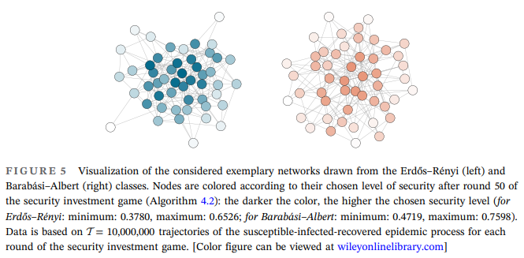
- 색상이 진할 수록 보안수준이 높음. 
  - Erdős–Rényi networks : [0.3780, 0.6526], Barabási–Albert networks : [0.4719, 0.7598]
- 더 많은 중앙노드가 주변노드보다 더 높은 보안수준을 선택함.

#### 4.2 Demand for regulation : Allocating additional security investments

4.2장에서는 2가지 질문을 다룸.

- 정상상태의 개별적인 최적보안 선택이 누적 총 비용을 최소화할 수 있는가? (전체 네트워크 관점에서 유리한가?)
- 추가적인 보안투자로 상황을 더 개선할 수 있는가?

하지만 개별적으로 보안수준이 최적이라고 해서 전체 네트워크의 총 비용을 최소화시키지는 못함.

- 이는 내쉬 균형에 의해 증명이 됨.
- 내쉬 균형 : 게임 이론에서 경쟁자 대응에 따라 최선의 선택을 하면 서로가 자신의 선택을 바꾸지 않는 균형상태

추가 보안투자 자금을 적절하게 배분하기 위해선 개별 노드의 centrality가 중요한 역할을 함.

- 그리고 이러한 centrality는 기본 네트워크의 topology에 의해 결정이 됨.
- 그러나 security investment game에서는 정상상태를 고정하고, 노드 i의 centrality를 개별적으로 $\mathcal{C}^{\text{inv}}(i)=\gamma^{\text{steady}}_i$로 정의하여 centrality를 측정하는 방법을 제안함.

#### 4.2.1 Allocation strategies

투자 게임 내 할당 전략은 세 단계로 구성됨.

- 

- 정상상태에서 시작함. 추가 예산은 $\beta >0$로 고정
- 추가 보안은 다음 전략 중 하나에 따라 노드에 할당됨.
  - Untargeted 할당 : 모든 네트워크에 균등하게 추가 예산 할당됨.
  - Targeted 할당 : 할당 가중치에 따라 할당량을 분배
    - Upper 할당 전략 : 중심성이 더 높은 노드에 더 많은 양의 $\beta$ 부여
    - Lower 할당 전략 : 할당 가중치의 역수를 사용
      - 
  - 이로 인해 새로운 보안 수준 벡터 생성됨 ($\tilde{\gamma}_i = \gamma_i^{\text{stedd}}+\gamma_i^{\text{all}}$)
- 새로운 security level에서 누적된 총 네트워크 비용 $\mathcal{E}(\tilde{\gamma})$를 계산함.

#### 4.2.2 Allocation for complex networks

$\beta=5$로 설정하여 두 네트워크에 다양한 할당 전략과 중앙 집중도 측정값 비교.

- 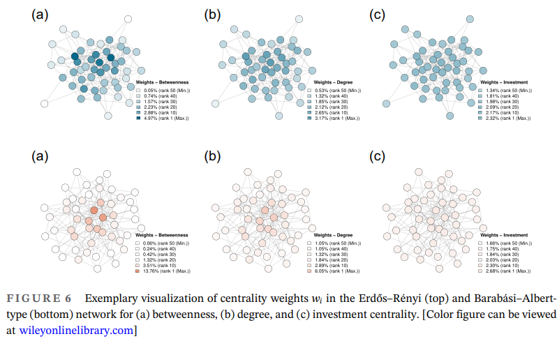
- 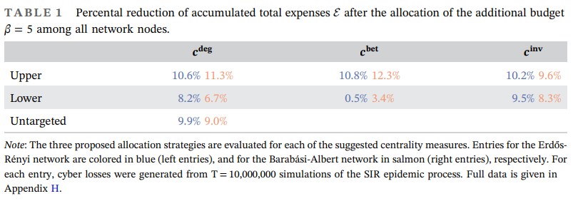
- 네트워크 보안을 추가적으로 도입하여 누적 총 비용을 줄일 수 있다.
- Untargeted 할당 전략과 lower 할당 전략보다, **targeted의 upper 할당 전략**을 사용했을 때 더 적은 손실을 얻을 수 있음.
- 토폴로지 기반 중심성 측정과 Upper 할당 전략의 결합이 더 나은 성과를 내었음.

#### 4.2.3 Further centralization of upper allocations

추가 예산 ($\beta$)를 할당 시, 모든 노드에 대한 고려의 문제점

- regulatory point of view 측면에서 불가능함.

따라서, highest centrality한 certain 노드 관찰의 결과를 보려고 함.

- 이를 위해, Upper allocation procedure 변경
- highest centrality node를 $\mathcal{I}$ 집합으로 정의. 이들에게만 가중치 부여
- 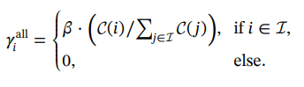

Modified Upper Allocation procedure는 네트워크에 따라 효율성이 달랐음. (Degree, Betweenness, Investment 측면에서)

- 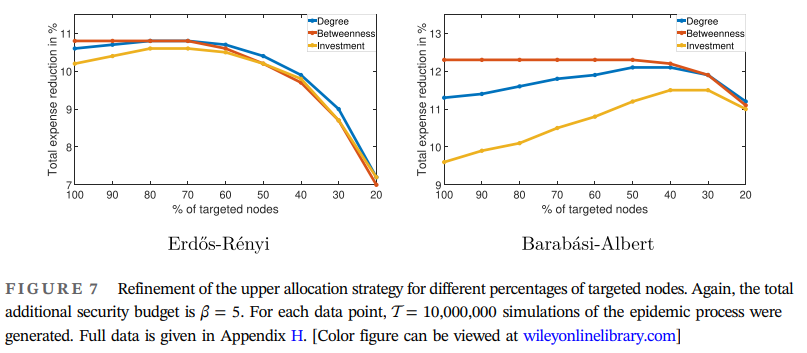
- Erdős–Rényi networks는 총 지출 측면에서 세 지표 모두 다 비슷했음.
- Barabási–Albert network는 Degree-centrality기반의 할당을 했을 때는 효과적이었으나, Betweenness-centrality 기반 할당했을 때 큰 차이 없었음
  - highest 노드 주변의 노드에 대한 할당 가중치가 0에 수렴하였기 때문.
- 주변 노드에 예산 할당하는 것이 비효율적이라는 것을 밝혀냄.

하지만 Modified upper allocation procedure가 무조건 최적의 전략은 아님.

- trade-off between costs and efficiency
- highly central node에 대한 추가 보안 투자는 비용이 많이 발생하기 때문.

따라서, **degree 기반 상위 50%에 해당하는 노드에 대해서 할당하는 것**이 가장 괜찮은 방법이다.

- Betweenness centrality를 기반 할당은 full network topology를 필요로 함.
- Degree 기반 할당은 local quantities이기 때문에 결정하기 쉬움.

#### 4.3 Evaluation of security-related interventions

보안 투자를 의무화하면, 전반적인 사이버 보안 수준을 크게 향상시킬 수 있음.

이러한 시뮬레이션은 3가지 가정을 기반으로 함.

- security 관련 규제를 도입한다.
  - self-regulation of interdependent actor는 네트워크 전체 관점에서 보았을 때 effective state로 만들지 못한다.
  - self-regulation이 아닌, additional security budget으로 달성할 수 있음.
  - 따라서, 규제가 필요하며, 적절한 보안 관련 의무를 도입함.
- 규제는 중대형 기업에 초점을 맞춘다.
  - weakly connected entities에 대한 규제는 네트워크 취약성을 줄이는데 큰 효과가 없음.
  - 그렇다고 해서 high centrality 노드에 대한 집중만으로는 좋은 결과를 낼 수 없음. (추가 투자는 막대한 비용증가를 수반함.)
  - 따라서, 중대형 (medium to large) 기업에 초점을 맞추어 규제를 함.
- Degree 기반 할당을 진행할 것이다.
  - Degree기반, Betweenness 기반 할당 모두 좋은 결과를 내었음.
  - 그 중, 실행하기 쉬운 degree기반 할당을 사용할 것임.

### 5. Case study 2 : Topology-based Interventions and Cyber pandemic risk

Cyber pandemic incidents (WannaCry, NotPetya) 방지를 위한 보험사의 역할

- to reduce the risk of potential cyber accumulation scenarios within their portfolios

5장에서 다룰 내용은 아래 세 가지다.

- Cyber pandemic risk exposure
- Necessity of interventions for targeting the underlying topological network structure
- Network heterogeneity massively amplifies the cyber pandemic risk

#### 5.1 Demand for regulation : Network topology and cyber pandemic risk

대규모 네트워크에서, SIR 모델 내 전염병 발생빈도 분포에 미치는 2가지 요소는 다음과 같다.

- small outbreaks, affecting only **a very small fraction of network nodes**
- proper epidemic outbreaks or pandemics, where **a large number of nodes** becomes infected

본 연구에서 진행하게 되는 시뮬레이션 연구에서는 다음과 같은 가정을 진행한다.

- 감염율과 회복율은 고정. ($\tau=0.1, \gamma = 1$)
- implies that detection of cyber incidents is expected to be 10 times faster than infectious transmission.

#### 5.1.1 Cyber pandemic risk in homogeneous networks

먼저 노드 개수가 1000개인 Erdős–Rényi networks로 cyber epidemic risk exposure를 관찰하였음.

- 네트워크의 topology는 모수 $p$ (control parameter of network connectivity), $N(=1000)$으로 결정됨.
- $p$에 변화를 주면서 risk exposure이 어떻게 달라지는지를 확인하였음.

frequency distribution of outbreak sizes는 다음과 같이 나왔음.

- 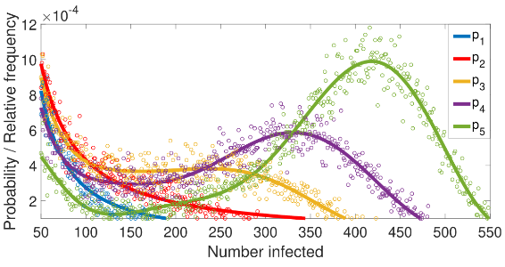
- $p$가 높아질수록 outbreak는 증가한다.
- $p_1=0.01<p_2=0.011<p_c<p_3=0.012<p_4=0.013<p_5=0.014$
- $p$값이 $p_c$보다 높아지면 second peak around a characteristic large break size가 발생함.

따라서 critical threshold $p_c$ 보다 아래로 연결 정도를 유지하는 것이 중요하다.

#### 5.1.2 The heterogeneous case: Cyber pandemic risk in scale-free networks

이번에는 Barabási–Albert networks에서 시뮬레이션 진행

- 실생활에서는 preferential attachment principal 원리를 고려해야 하므로 (more heterogeneous topology)
- 확률변수 $K$를 도입. (under preferential attachment, distribution of node degrees follows power-law)
  - $P(K=k)\sim k^{-\alpha}$
  - $\alpha=3$인 경우를 **scale-free network**라고 부름. (heavily connected high-degree hubs in their center, less connected nodes in their periphery)

network topology의 차이는 epidemic vulnerability에 큰 영향을 줌.

- 두 네트워크는 서로 다른 topology를 가지고 있음.
- 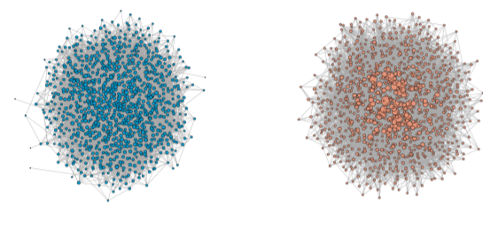
- Barabási–Albert network의 epidemic vulnerability가 더 높다.
- 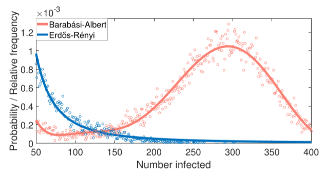
- Barabási–Albert network (1000;5), Erdős–Rényi network($G_{0.01}(1000)$)으로 10만번의 시뮬레이션을 돌린 결과
- outbreak 빈도 분포를 보면, Erdős–Rényi networks는 second peak가 없는 반면, Barabási–Albert network는 명확하게 second peak가 관찰됨.
- 이를 통해 Barabási–Albert network의 topology는 더 낮은 critical connectivity threshold ($p_c$)를 유발하는 구조임을 알 수 있음. (it amplifies the epidemic spread / it triggers the emergence of large-scale outbreaks.)

왜  Barabási–Albert network의 topology는 cyber pandemic incident에 취약한가?

-  Erdős–Rényi networks의 degree distribution은 포아송 분포 ($\lambda$)를 따름.
  - 만약 $\gamma \geq \tau(\lambda-1)$을 만족하면 cyber pandemic을 무한대로 예방할 수 있음.
- Scale-free network는 단순히 security를 향상하거나 network connectivity를 줄인다고 해서 효과가 없음.
  - $E[K]$에 비해 $E[K^2]$가 기하급수적으로 커지게 되면서 $\gamma$가 증가하게 됨. 
  - 이로 인해 비용이 기하급수적으로 상승하게 됨.

따라서 Scale-free network에서의 리스크 관리 방법은 다음과 같다.

- cyber pandemics are an inherent risk of the scale-free network topology
- 따라서 manipulation of the degree distribution, that is, the topological network arrangement를 필요로 함.

#### 5.2 Implementing suitable interventions

cyber network의 topology와 취약성은 관계가 높음.

하지만 이러한 topology 조작은 비용이 많이 들기 때문에 limit or control critical network connections and nodes.

- edge removal: physical deletion of connections, edge hardening
- node splitting: separate contagion channels, let them pass through two different nodes with the same operational risk.

측정지표는 average shortest path length $<l>$을 사용

- $<l>$ : the minimum number of edges connecting $i$ and $j$.
- $<l>=\Sigma_{i,j} \frac{1}{N(N-1)}l_{ij}$
- $<l>$값이 작을 수록 fast and efficient data flow를 의미. 따라서 high network functionality.

#### 5.2.1 Edge removal and node splitting

본 섹션에서는 Edge removal과 node splitting 중, 어떤 것이 더 효율적인지를 확인함.

edge removal: edge centrality를 이용하여 엣지를 삭제함.

- 순서

#### 5.2.2 Risk allocation and design of contractual obligations

#### 5.3 Evaluation of topology-based interventions

### 6. Conclusion

