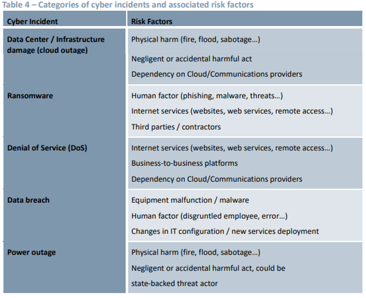
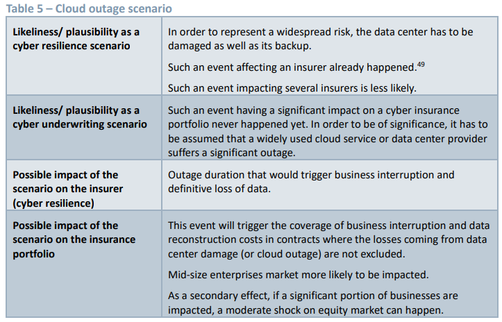
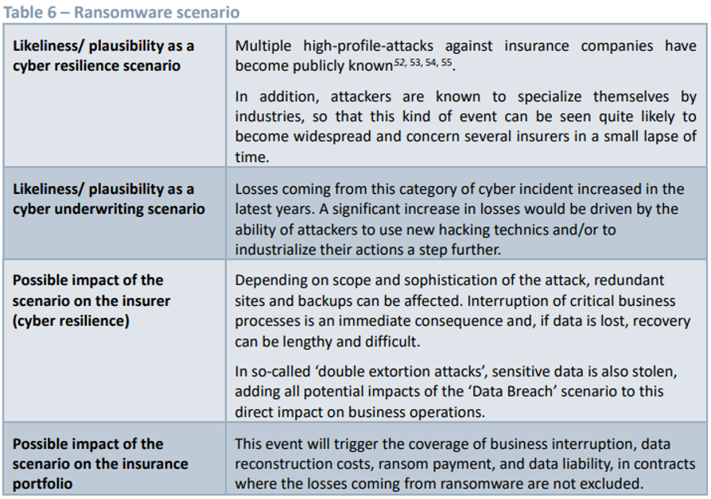
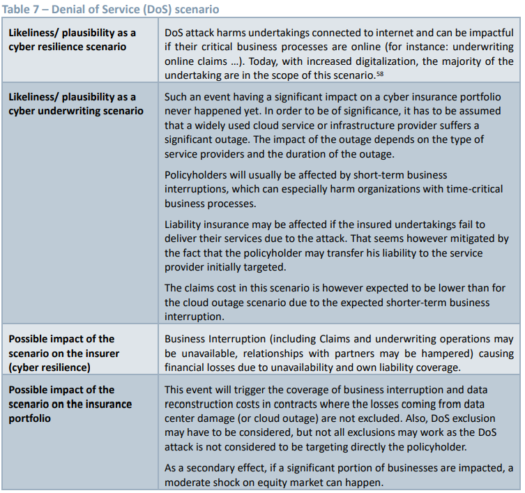

## Methodological Principles of Insurance Stress Testing

> Title : Methodological Principles of Insurance Stress Testing
>
> Journal : European Insurance and Occupational Pensions Authority 2023
>
> Summary : 

#### 용어정리

- Cyber Resilience (사이버 회복력/저항력) : 사이버 공격으로부터의 회복력과 유연성. **사이버 공격을 대비하고 서전에 탐지하는 능력**을 말함. 
- Cyber Underwriting : 보험기업이 기업이나 조직의 사이버리스크를 평가하고, 이에 대한 **보험 상품을 개발**하는 프로세스를 말함.

### 1. Introduction

스트레스 테스트는 유럽계 보험업의 취약점을 평가할 수 있는 방법 중 하나이다.

- EIOPA는 stress test framework를 운영하고 발전시켜왔음.
- 또한 다양한 논문들도 작성해왔는데, 이러한 논문들은 상향식 스트레스 테스트에 대한 EIOPA의 접근 방식 강화를 목적으로 함.

본 논문에서는 **사이버리스크 관련 보험 스트레스 테스트의 디자인을 확립하는 것을 목적**으로 한다.

- 디지털화와 사이버리스크는 현 시점 가장 중요한 리스크 중 하나이며, 유럽 및 국제 규제기관들로부터 많은 관심을 받고 있음.
  - IMF는 사이버리스크가 금융 안정에 핵심위협요소라고 정의함.

> 💬 스트레스 테스트란? ([링크](https://www.moef.go.kr/sisa/dictionary/detail?idx=1604), [위키백과](https://ko.wikipedia.org/wiki/%EC%8A%A4%ED%8A%B8%EB%A0%88%EC%8A%A4_%ED%85%8C%EC%8A%A4%ED%8A%B8))
>
> - 실현 가능성이 있는 사건에 대하여, 금융 시스템의 잠재적 취약성으르 측정함으로써 안정성을 평가하는 것
> - 생산, 환율 등과 같은 특정 거시경제변수의 급격한 변동을 가정하고 이러한 상황에 대하여 시스템이 얼마나 안정적일 수 있는지를 측정해보는 것.
> - 결과 관찰을 목적으로 이따금은 한계점에 이를 만큼의 일반적인 운용 능력을 넘어서는 테스트를 수반한다.
> - 예외적이지만 일어날 수 있는 가능성이 있는 여러 시나리오를 상정하여 그러한 위기 상황시 해당 금융기관의 재무 건전성을 파악하는 것.
>   - 실업률이 X% 증가하면 어떤 변화가 얼마나 일어날 있을 것인가?
>   - GDP가 X% 하락하면 어떤 변화가 얼마나 일어날 있을 것인가?
>   - 이자율이 X% 상승하면 어떤 변화가 얼마나 일어날 있을 것인가?
>   - 원유가격이 X% 상,하락하면 어떤 변화가 얼마나 일어날 있을 것인가?
> - 하지만, 이런 가상의 위기 상황에 따른 손익계산서와 대차대조표의 모의 결과는 개별 금융기관만이 당하는 어려움만 보여줄 뿐, 전체 금융 시장(금융기관 서로가 서로에게 채권자이자 채무자인 복잡한 시스템)이 혼란에 처하였을 경우에 대해서는 제대로 된 답을 줄 수 없다.

### 2. Cyber Risk for Insurers

#### 2.1 Cyber risk : Main Concepts

- 사이버 리스크에 대한 명확한 정의는 없음.
- 다양한 사이버리스크 정의들 소개되어 있음. (논문 참고바람)

#### 2.2 Cyber Resilience : Insurers as Direct Targets of Cyber Attacks

- 사이버공격은 (1)공격의 목적, (2) 공격자 타입, (3) 어떻게 공격했는지, (4) 영향력에 따라 다양하게 나뉨.
- 각각에 대해서 모든 부분들을 다루는 것은 비현실적이므로, 가정을 통해 현실적인 시나리오 작성을 하고자 함.

#### 2.2.1 Motivation of Cyber Attacks against Insurers

### 5. Scenarios

#### 5.1 Scenario Selection

사이버리스크 스트레스 테스트 시나리오를 정의하기 전, 어떤 사이버 사건을 선택할 것인지, 리스크 요인은 어떤것을 사용할 것인지 등등을 고려해야 한다.

- 하지만 몇몇 보험회사의 사이버 포트폴리오에 영향을 끼치는 충격요소을 정의하기는 어렵다.
- 또한, 사이버 사건을 발생시키는 요인에 대한 정의가 명확하게 되어 있지 않다.
  - 요인은 사이버범죄로 인해 발달된 새로운 기술이 될 수도 있고, 몇몇 산업에서 발생되는 새로운 IT 사용현황이 될 수도 있음.

본 논문에서 묘사되는 cyber resilience, cyber underwriting, 그리고 둘 다에 대해 직접적으로 영향을 끼칠 수 있는 핵심 이벤트들을 다룸.

- 충격요소는 사이버회복력과 사이버 인수에서 각각 다르게 다루어질 것임.
- 

#### 5.2 Scenario Narratives and Specifications

시나리오 수준(scenario specification)에 대한 고려도 매우 중요한 요소임. (집계 수준에 따른 시나리오 구체화를 할 것이므로)

- **사이버 언더라이팅(cyber underwriting) 영향 요소** : intensity of cyber incident, its duration, percentage of infected policyholders 
  - potential increase in claims on cyber policies
  - impact on new business or increase in termination aspects
- **사이버 회복력(cyber resilience) 영향 요소** : intensity of cyber incident, its duration, percentage of operational units infected of the participating undertaking itself
  - business interruption cost
  - total monetary cost of recovery
  - time elapsed until return to business as usual

#### 5.2.1 Data Center/Infrastructure Damage (Cloud Outage)

- 

IT 인프라 (서버, 데이터 베이스, 백업 저장소)로부터의 손실은 대개 자연재해나 서비스 공급자의 실수로 인해 발생함

- 이러한 손실은 회사의 많은 부서들에 영향을 줌.
- 사이버 회복 : 대부분의 현대회사들에게 데이터센터는 매우 중요하므로, 랜섬웨어 시나리오와 같은 심각한 충격에 대한 해결이 가장 어려움.
- 사이버 언더라이팅 : 여러 개의 데이터센터냐, 한 개의 데이터센터냐에 따라 영향력이 달라짐.
  - IT 인프라 관련 시나리오는 큰 기업보다는 작은 기업에 더 영향력이 있다.

#### 5.2.2 Randsomeware

- 

#### 5.2.3 Denial of Service (DOS)

- 

#### 5.2.4 Data Breach

#### 5.2.5 Power Outage

### 5.3 Scenarios not retained for the purpose of this paper

