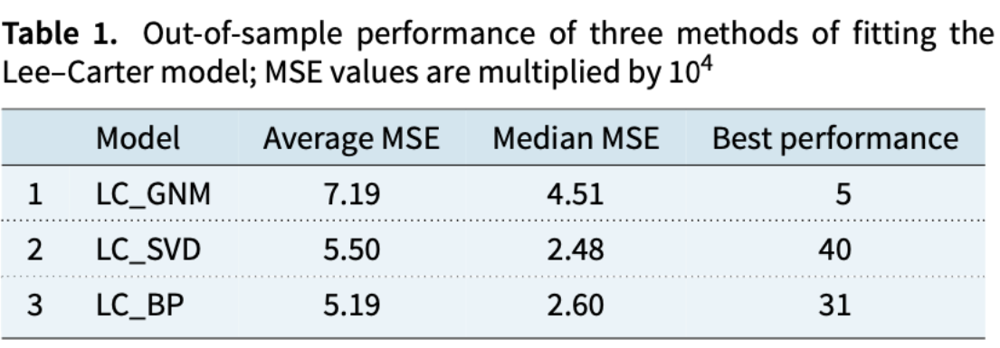

## A Neural network extension of the Lee-Carter model to multiple populations

> Title : A Neural network extension of the Lee-Carter model to multiple populations
>
> Authors : Ronald Richman, Mario V. Wuthrich
>
> Journal : Annals of Actuarial Science

#### 논문 읽으면서 궁금한 점

> **1. 왜 Lee-Carter 모델은 multiple populations에 적용되기 힘든 것인가?**
>
> **2. $k_t$가 시간지수라고 표현되어 있던데, 정확하게 무엇일까?**
>
> - $k_t$가 감소할 수록 사망률이 개선되는 것으로 알고 있으면 됨.
>
> **3. Best Performance는 왜 76개인가?**
>
> - 38개의 국가, 남성/여성
> - Best Performance를 통해 single population으로 학습했을 때의 비교정도를 알 수 있다.

### 1. Introduction

기존 모델의 단점

- 기존에는 LC모델, CBD 모델을 많이 사용하며, 이들은 single population에서만 적용이 됨.
- 여기서 single population은 한 국가의 인구 (A 국가 내 남성/여성), multiple population은 모든 국가의 인구 (A국가 내 모든 인구 혹은 모든 국가의 남성/여성)
- 만약 9개의 나라에 LC모델을 적용하여 사망률을 예측하고자 하면 총 9개의 모델을 사용해야 함.

따라서 본 논문에서는 아래의 조건을 만족하는 적합한 사망률 예측 모델을 제안함.

- less manual feature engineering을 해야 함.
- fit to many populations simultaneously -> multiple population에 적용이 가능해야 함.
- fit using relatively standard optimisation approaches

그리고 위의 조건들을 인공 신경망을 사용해서 LC모델을 multiple population으로 확장하고자 함.

### **2. The LC Model and Extensions**

기존 LC 모델과 Notations

- $$\log(u_{x,t}) = a_x + b_x k_t$$
- $t$ : 시점
- $x$ : 나이
- $a_x$ : 나이가 x세일 때 평균 사망률의 로그값
- $b_x$ : 나이가 x세일 때 사망률의 변화율
- $k_t$ : 시간 지수

이때, $b_x k_t$는 Gaussian Linear Model에 적합하지 않음. 따라서 아래의 방식을 사용

- 특이값 분해
- GNM(Gaussian Non-linear Model) 사용

LC모델의 확장 -1) ACF 모델

- ACF 모델
  - Augmented Common Factor Model의 준말
  - $\log(u_{x,t}) = a^i_x + b^i_x k^i_t + b_x k_t$
  - 특정 그룹($i$)에 해당하는 식과 전체 인구에 대한 식을 합한 형태
  - 이러한 형태로 multiple population의 사망률을 추정할 수 있음.
  - 특정 그룹 $i$는 대표적으로 같은 국가 안의 남성과 여성 / 혹은 다른 국가의 사람들

- CAE 모델
  - Common Age Effect Model의 준말
  - ACF 모델의 단순화 버전
  - $\log(u_{x,t}) = a^i_x + b_x k^i_t$
- 결합된 버전의 모델
  - $\log(u_{x,t}) = a^i_x + b(1)_x k(1)^i_t + b(2)_x k(2)^i _t$
  - 여기서 $b(1)$은 사망률 구성요소의 첫 변화율을 의미한다.

LC 모델의 한계와 연구 방향

- LC모델은 왜 이런 specification이 이런 결과를 내는지 모르기에 LC모델은 임의적이고 어떻게 모델링하는지에 의존적 -> 이는 자동화의 필요성을 말해준다.
- LC모델의 확장된 버전은 비슷하지 않은 사망률 데이터셋에는 동시에 학습할 수 없음 -> 인공신경망으로 1950년대부터 측정된 HMD 데이터셋으로 사망률을 측정함.

### **4. Fitting the Models and Results**

총 38개의 국가들을 대상으로 실험하였으며, 남성/여성으로 나뉘므로 76개의 샘플을 나옴.

- Average MSE : 손실값들의 평균
- Median MSE : 손실값들의 중앙값
- Best Performance : 총 76개 중 최고의 성과를 낸 것. 이는 single population 우선순위를 매기기 위함임.

LC모델의 결과는 다음과 같이 나옴

- 
- LC_GNM의 성능이 제일 좋지 않음.
- 특이값 분해를 통해 얻은 결과가 제일 좋았다.
- 따라서, LC_SVD을 비교군으로 설정

ACF모델의 결과는 다음과 같이 나옴

- 
- ACF_SVD_region : $\log(u_{x,t}) = a_x + b_x k_t$
- ACF_SVD_country : $\log(u_{x,t}) = a_x + b_x k_t + b^i _x + k^i _t$
- ACF_SVD_region의 성능이 제일 좋았음을 알 수 있다.
- 몇몇 국가에서는 기존 LC모델의 성능이 나빴다.

CAE모델의 결과는 다음과 같이 나옴

- 
- CAE모델은 전반적으로 다 성능이 좋지 않음.

딥러닝 모델의 결과는 다음과 같이 나옴

- 
- 

최종 결과

- 

