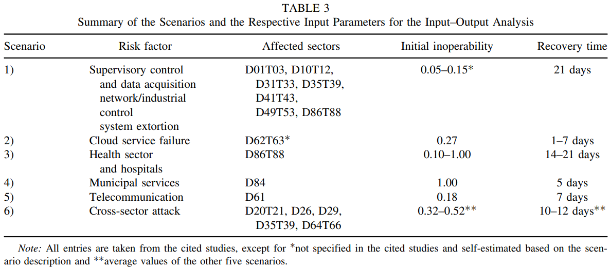

# The Economic Impact of Extreme Cyber Risk Scenarios

> Title : The Economic Impact of Extreme Cyber Risk Scenarios
>
> Authors : Martin Eling, Mauro Elvedi & Greg Falco
>
> Journal : North American Actuarial Journal 2023

### 1. Motivation and Aim

- Cyber Risk에 대한 위험도 높아지고 있음.
  - 연간 1000억달러까지 그 피해가 이를 예정
  - 코로나 및 디지털 기술 증가로 사이버 위험에 대한 가능성 높아짐.
- 이런 상황에서, 과거 데이터의 가용성으로 인해 문제 발생.
- 본 논문에서는 다양한 시나이로에 따른 경제적 영향을 일관성 있게 분석하는 방법론을 제시
  - 6가지 사이버 리스크 시나리오 검토 및 평가 / 각각 시나리오들의 특징들을 필터링
  - 손실 정량화를 위한 프레임워크 제안 : 과거 및 미래의 사고 비용 평가 및 적용
  - 이를 통해 조직은 정보 보안에 지출할 최적 금액을 결정할 수 있고, 일관적이고 복제 가능한 방식으로 경제적 영향력을 측정할 수 있음.

### 2. Definitions and Literature review

#### 2.1 Cyber Risk

- 사이버 리스크의 정의와 심각성 설명

#### 2.2 Scenario Analysis

- 시나리오란?
  - 내부적으로 일관된 가정에 기초하여 미래가 어떻게 전개될 것인지에 대한 그럴듯한 설명
  - 예상이나 예측하는 것을 넘어, 미래 상태에 대한 구조화된 설명 제시
  - 시나리오 정의, 구성, 분석, 평가, 위험관리의 순서를 거침
  - 관련성, 일관성, 가능성, 중요성, 투명성을 충족해야 함.
- Cyber risk 시나리오
  - 누적 위험으로 이어지는 사이버 사고와 관련된 불확실성의 핵심요소를 포착하고 스토리로 이를 정의함.
  - 각 시나리오들의 가능성 및 결과 분석을 용이하게 함.
- 본 논문에서는 민감도 분석으로 경제적 손실 시나리오를 제안함.
- 또한 사이버리스크 시나리오 분류를 위한 표준화되고 일관된 유형과 방법을 설명함.

#### 2.3 Economic Impact Analysis

- 기존 시나리오의 경제적 영향력 분석에는 여러 문제점이 존재함.
- 본 논문은 프레임워크를 사용하여 경제적 영향력을 분석/비교함.
- 본 논문에서는 "Input-Output Model"을 사용함. 이를 통해,
  - 타 연구자들이 결과 복제 및 시나리오를 분석할 수 있게 함.
  - **여러 부문 간의 경제적 상호 의존성을 명시적으로 반영**할 수 있음.
  - Cyber attack의 단기 교란의 영향 분석에 적합함.
  - 인위적 위험(자연재해)의 경제적 결과도 분석하여 Cyber attack에 의한 경제적 손실을 총체적 추정 및 다양한 복구 시간 고려를 가능하게 함.

### 3. Methodology

#### 3.1 Leontief Input-Ouput Model

- 본 모델의 장점
  - 지역 및 국가 경제의 균형상태를 설명할 수 있음.
  - 상호의존적인 부분으로 구성된 경제의 disruption의 영향을 설명할 수 있음.
  - Original input-output model의 함수는 다음과 같음.
    - $\mathbf{x} = A \mathbf{x} + c \longleftrightarrow \{x_i = \underset{j}{\Sigma} a_{ij} x_j + c_i\}, \ \forall i$
    - $x_i$는 $i$ 부문의 총 생산량, $c_i$는 $i$번째 부문에서의 최종 수요량
    - $a_{ij}$는 Leontief model의 계수이며, $i$부문의 투입량 대비 $j$ 부문의 투입량의 비율을 나타냄.

#### 3.2 Inoperability Input-Output Model

- 전통 Leontief 모델의 확장 버전
- 기술계수 행렬 $a_{ij}$ 대신, 상호의존성 행렬을 사용
- 특정 경제 부문의 inoperability가 경제 전반에 끼치는 영향과 상호의존성을 분석하여 inoperability의 증폭 및 확산 정도를 파악할 수 있음.
- 아래 함수를 가짐.
  - $q = A^*q + c^* = [I-A^*]c^*$
  - $q$는 수요 기반의 inoperability 행렬, $A^*$는 수요 기반 상호의존성 행렬, $C^*$는 수요기반의 perturbation 벡터.

#### 3.3 Data Sources for the Analysis of Economic Disruptions.

- OECD에서 제공하는 국가 별 투입-산출 거래표를 기반으로 모델을 구축하였음.
- 재화와 서비스의 산업 간 흐름에 대한 행렬을 제시

### 4. Cyber Risk Scenarios

- Cyber attack에는 다양한 유형들이 존재함.
- Cyber Risk 시나리오는 최악의 cyber attack을 말로 풀어서 설명함.
- 총 6가지의 사이버 Risk 시나리오를 선정함.
  - Supervisory Control과 데이터 수집 네트워크의 공격
  - 클라우드 서비스 provider 장애
  - 의료부문, 병원에 대한 Cyber attack
  - 지자체 서비스의 타협
  - 인터넷 통신 장애
  - 부문 간 IT 장애
- 위 시나리오들은 누적피해 가능성이 높으며, 여러 부문/국가에 확장 피해를 끼칠 수 있음.
- 한 시나리오는 광범위한 사이버 위험 공격 스펙트럼을 포괄함.
- 컴퓨터 및 네트워크와 관련된 사건 분류체계에 따른 시나리오 분류
  - 
- 입력-출력 분석을 위한 시나리오 및 각 입력 파라미터들 요약
  - 
  - 