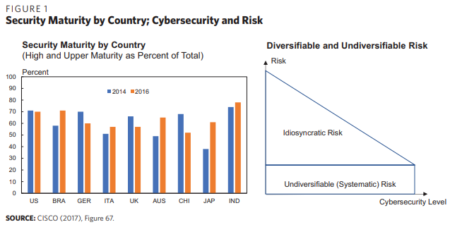
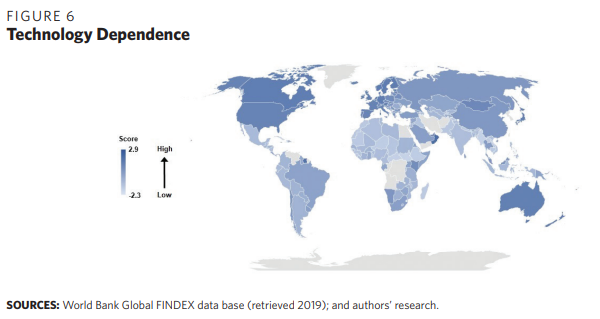
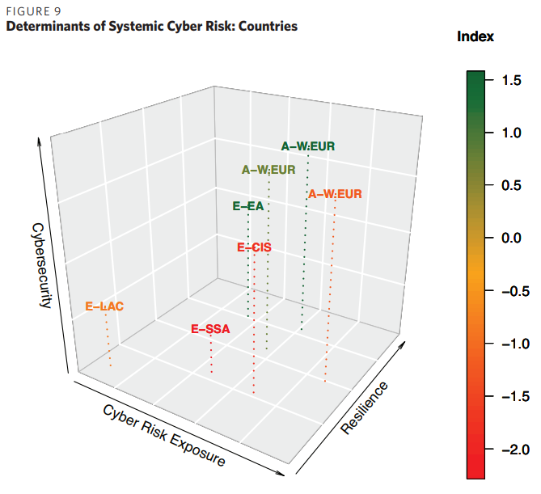

## Cyber Risk Scenarios, the Financial System, and Systemic Risk Assessment

> Title : Cyber Risk Scenarios, the Financial System, and Systemic Risk Assessment
>
> Authors : Lincoln Kaffenberger and Emanuel Kopp
>
> Journal : Carnegie Endowment for International Peace 2019
>
> Summary : 본 논문은 시나리오 분석 및 위험도 평가를 위한 프레임워크를 제안한다.
>
> - **Scenario Analysis의 기준은 다음과 같이 설정**
>   - High-Impact Operational Risk Scenarios
>   - Upstream Infrastructure Scenarios
>   - External Shock Scenarios
>
> - **Conceptual Framework 구축 과정 내 주요 요인은 다음과 같이 설정**
>   - Cyber Risk Exposure
>   - Cybersecurity and Preparedness
>   - Shock Resilience

### 용어 정리

- Upstream Infrastructure : 

### 1. Introduction

본 논문의 목적 : Systemic Cyber risk에 대한 이해도 높이기

- 시나리오 작성을 통한 사이버 리스크의 특성에 대한 설명
  - 발생 범위가 개인기업 단위인 것부터 upstream infrastructure disruption ~ external shocks까지 다룸
- Systemic 사이버리스크 평가를 위한 프레임워크 구축

### 2. Properties of Cyber Risk

#### Complexity and Risk Aggregation

근 15년 동안 인터넷 사용률 증가하면서 많은 IoT 서비스들의 기술적 취약점 발생

- 이러한 소프트웨어의 결점으로 사이버 안전 위험이 발생
  - maturity 높이면 경제적으로 돈이 많이 들기 때문에, 공급업체는 더 싼 가격에 저렴한 security 투자
  - 따라서 이로 인한 비분산 리스크는 무조건 존재
- 정보 비대칭과 어긋난 인센티브로 인해 만성적인 비분산 리스크를 야기하게 됨.
  - 이로 인해 다른 네트워크 사용자가 부담하는 부정적 외부효과를 생성.
  - 

시간이 지날수록, Cyber risk는 한 회사에만 국한되는 것이 아닌 **회사의 파트너까지 연결되어 복합적으로 발생하기 시작**함

- 이렇게 되면서, 사이버리스크는 한 개인회사의 통제를 벗어나게 됨
  - upstream infrastructure : electricity, telecommunication, financial market infrastructure
  - technological externalities : the entry of disruptive new technologies
- 이때, 파트너들의 사이버리스크 노출을 관찰하는 것은 어려움
- 또한 자연재해, 군대공격과 같이 정부의 개입이 필요한 예상치못한 리스크들 발생할 수 있음.
- 

전세계적으로, 사이버리스크로 인한 손실은 1년에 2500억달러~1조달러까지 이른다.

- 직접적 비용에 대한 정보는 잘 구축되어 있음
  - 대표적으로 법의학 조사, 법률지원, 고객 공지, 위반 후 고객 보안 및 신용, 보호비용 등이 있음.
- 하지만 **간접적 비용에 대한 정보는 장기간이며, 측량하기가 어려움.**
  - 대표적으로 평판리스크, 지적재산의 감가상각, 지속적인 운영/위험비용의 증가가 있음.

#### Systemic Risk

사이버리스크 평가는 개별 수준에 대해서는 우세를 보이나, 시스템차원에 대해서는 상당히 좁은 관점을 보임

- 현재 금융기관에서의 리스크 평가는 개인 회사단위에 집중
- 사이버의 시스템적인 본성에 대한 고려 없음
- 시스템적인 본성이란?
  - 사이버리스크는 복잡한 인프라에 대한 의존성으로 인해 발생함
  - 사이버리스크는 주요 정보 시스템 방해로부터 발생함.

Systemic Cyber risk는 아래 세 가지 요인에 의해 발생한다.

- 리스크 수렴과 대체가능성의 부족
- 신뢰도 손실과 리스크 상관관계
- 효과를 증폭시키는 복잡한 상호연결

### 3. Scenarios

### 3.1 Scale and Timing

- 시나리오 작성시, 사건의 규모의 타이밍은 매우 중요한 요소.

사건의 규모, 시나리오의 개수, 그리고 시나리오의 타이밍은 매우 중요한 요소다.

- 위의 요인들에 의해, 초기의 작고 특이한 사이버사건이 systemic 사이버 사건으로 확장될 수 있음.
- 확장되는 과정에서, 알 수 없는 연결과 조직 간의 종속성으로 인해 계단식 효과처럼 사건이 커지게 됨.

시나리오의 타이밍은 systemic 사이버사건 구체화에 매우 중요하다.

- 시스템이나 국가적 차원의 타이밍은 특정 금융부문 기능이 더 많이 사용되는 시기에 영향을 미치므로, 손실이나 혼란의 영향이 커짐.
- 사건의 타이밍과 금융범죄의 요인들은 예측이 어려우므로, 금융 시스템의 안정성 분석은 아래의 요인들에 맞추어서 진행됨.
  - 시스템 내 취약성 확인
  - 회복력을 높이기 위한 완충장치의 확립

가상의 adverse scenario는 기업과 정책론자로 하여금, 리스크 완화요인을 확인할 수 있도록 한다.

- 왜냐하면 시나리오 만드는 과정에서 리스크의 잠재적 요인 확인하는 과정을 요구하기 때문.
- 리스크 발생시에 대한 여러 가지 상황에 대해 시뮬레이션을 돌리기 때문에 잠재적 리스크에 대한 이해를 도울 수 있음.

### 3.2 Systemization of Cyber Risk Scenarios

시나리오 작성 전, 철저한 리스크 평가가 필요함.

- 리스크가 어떻게 도래했는지를 확인해야 함 : within the current realm of operational risk, from the organization's upstream infrastructure, or from an external shock?

- 

- 위의 내용을 바탕으로 아래와 같이 세 개의 시나리오를 작성
  - High-Impact Operational risk Scenarios
  - Upstream Infrastructure Scenarios
  - External Shock and Other Scenarios
  
- **1) High-Impact Operational Risk** 

  - Operational risk: 내부의 부적절한 공정, 사람, 시스템이나 내부 IT에 영향을 주는 외부의 영향으로 인해 발생한 손실 위험을 의미한다.

  - | Scenario                                                     | Description                                                  | Example                 |
    | ------------------------------------------------------------ | ------------------------------------------------------------ | ----------------------- |
    | 금융 기관에서의 malware, Ransomware 발생                     | 대형 은행 같은 경우, 랜섬웨어의 피해자가 되어 은행의 컴퓨터 대부분을 사용할 수 없게 되면 운영 중단/고객 서비스 중단이 발생함 | Shamoon virus, WannaCry |
    | 거액 송금 사기                                               | 금융기관은 사이버 공격으로인한 사기송금으로 금전적 손실을 겪음. 내부자의 도움을 받은 범죄자가 악성코드설치로 자금을 훔쳐 거액의 이체를 조율하게 됨. |                         |
    | 데이터 유출 및 표적 정보 유출                                | 평가기관, 금융기관 등에서 민감한 데이터, 이메일, 서류들을 유출시켜서 신뢰성을 떨어뜨림. |                         |
    | 거래 시스템에 멀웨어 설치                                    | 거래시스템에 침입하여 비정상적으로 많은 거래량을 유도. 이를 통해 시장을 방해하여 주요 거래 플랫폼이 손상되었다는 의심을 키움. |                         |
    | 금융 거래를 위한 글로벌 messaging 네트워크에 대한 대규모 사이버공격 | 메시지를 통한 네트워킹을 방해.                               |                         |
    | 시스템적으로 중요한 기관에 동시다발적인 사이버공격           | 핵심 인프라에 수많은 공격들을 동시에 진행. 여러 사건이 연결되어 있다는 증거는 없지만 시기적으로 보았을 때 절대 우연이 아님. |                         |

- **2) Upstream Infrastructure Scenarios**

  - |      |      |      |
    | ---- | ---- | ---- |
    |      |      |      |
    |      |      |      |
    |      |      |      |
    |      |      |      |
    |      |      |      |

    

#### Upstream Infrastructure Scenarios

**가상 시나리오 - 1 : Disruptions to Central Clearing**

- CCP는 제 기능을 못하게 하는 조직적인 사이버공격의 피해자로, 이로 인해 올바른 거래를 하지 못하게 됨.
- 이러한 사이버 공격은 몇 달 동안 지속되며, 이로 인해 CCP의 고객들로 하여금 다른 대안을 찾도록 만든다.

**가상 시나리오 - 2 : Attack Disrupts Payment-Processing Gateways**

- 사이버 공격은 결제 시스템에 간헐적 장애를 유발하여, 몇몇 나라들에 걸쳐 만대 이상의 기업과 그 고객에게 몇 주동안의 영향을 끼침.

**가상 시나리오 - 3 : Massive Malware Infection**

- 공장 내에서 은밀하게 설치된 멀웨어로 인해, 수많은 라우터가 동시에 오작동을 일으킴
- 이로 인해 인터넷이 끊겼으며, 결제시스템이 한동안 운영되지 않음.
- 회사들은 결국 멀웨어에 감염되지 않은 다른 공급업체로부터 공유기를 구매하였으며, 이로 인해 회복이 지연되고 경제에 중대한 영향을 미침

**가상 시나리오 - 4 : Cloud Provider Fails**

- 대규모 클라우드 서비스가 갑자기 어떠한 이유로 마비됨.
- 이 서비스를 이용한 회사들은 더 이상 운영할 수 없게 되어 경제의 상당 부분과 다른 나라에 영향을 끼치게 됨.
- 결국 많은 회사들이 인터넷에 대한 신뢰를 잃게 되어 공급업체와 제 3자에게 도움을 요청하게 됨.

**가상 시나리오 - 5: Utilities Disruption Causes Knock-On Effects**

- Upstream 인프라의 마비는 금융/경제 부문에 노크 효과를 일으킴.
  - 금융 부문 및 다른 주요 인프라는 전기에 의존하는데, 이 전기를 통해 통신사가 제대로 작동하게 할 수 있음.
  - 이러한 의존하는 어떠한 것에 지속되는 방해는 금융 부문 측면에서 서비스와 기능 제공을 못하게 함.

#### External Shock and Other Scenarios

**가상 시나리오 - 1 : Sanctions Retaliation via Cyber Attack**

- 제재를 받은 국가가 제재를 가한 국가의 금융기관에 다양한 사이버 공격을 행함
- 이때, 작은 중소은행들을 집중적으로 공격하여 더 큰 영향을 주고자 함. 대표적은 공격은 다음과 같음
  - disruptive attacks affecting institutions' connectivity
  - multiple data breach and leaks of sensitive data from small and medium banks
  - public claim that releases of data from larger institutions will follow
  - multiple thefts from small and medium banks
- 위의 공격들로 인해 금융기관에 대한 신뢰가 훼손되어 작은 은행에 대한 규모 인출이 발생.
- 이를 통해 금융 부문 전반적으로 유동성 충격이 전파될 위험 가능성 증가.

**가상 시나리오 - 2 : Armed Conflict**

- 라이벌 국가와 군사적 대립이 있는 경우, 다음 기관들에 Cyber attack을 진행함
  - 클라우드 서비스, telecommunication 인프라, 원전센터
- 이를 통해 라이벌 국가의 군사적 대응 지연 및 무력화를 시켜 금융부문 및 3자 서비스 공급업체에 대해 영향을 끼침.

### 4. Assessing Systemic Cyber Risk on the National Level

본 section에서는 **국가 단위로 systemic cyber risk 평가를 위한 conceptual framework를 제안**한다.

- 각 나라마다 Cyber Risk에 대한 민감도 다름.
- 따라서 나라별 차이점을 알면 각각의 Systemic Cyber Risk Event의 위험도 평가에 도움됨

**Conceptual Framework 평가 방식**은 아래 순서를 따름

- 먼저 각 나라별 리스크 노출 정도를 평가
- 그리고 각 나라 별 사이버 리스크 관리를 위한 Cybersecurity와 Preparedness를 평가
- 최종적으로 각 나라 별 Cyber attack의 충격을 흡수하는 완충장치의 사이즈에 따른 회복력을 평가

#### Cyber Risk Exposure

- Cyber Threat Level
  - Cyber Risk에 위협이 되는 요소는 무엇인지, 어떤 요소가 국가 금융기관에 영향을 끼치는지 조사
  - 그 위협의 잠재적 규모를 확인
  - 상대적인 비교를 숫자로 표현해 z값으로 표현
- Technology Dependence
  - Cyber Risk에 대한 기술적 노출은 Cyber attack을 유발할 수 있는 취약점들의 집합.
  - 연결성이 증가하면서 취약성 위험 증가. 이는 곧 systemic cyber risk의 발생 가능성을 높임.
  - 

#### Cybersecurity and Preparedness

좋은 Cybersecurity는 국가적 Systemic cyber risk 노출 정도를 줄일 수 있음.

- 법률이나 규제기간 등 효과적인 incident-response 활동들을 통해 사이버 사건의 확산을 줄일 수 있음.

Cybersecurity 측정 지표는 5개의 pillar로 이루어짐.

- legal, technical, organizational, capacity building, cooperation
- 

#### Shock Resilience

Systemic Cyber Risk에 대한 회복력은 완충장치의 규모와 품질에 따라 달라진다.

- 

#### Systemic Cyber Risk Index

지금까지의 결과(based on Cyber Risk Exposure, Cybersecurity and Preparedness, Shock Resilience)를 바탕으로, 아래의 결론을 낼 수 있음.

- | Cyber threat | Financial Shock Resilience | 결론                                              |
  | ------------ | -------------------------- | ------------------------------------------------- |
  | high         | low                        | countries most susceptible to systemic cyber risk |
  | low          | high                       | lowest levels of systemic cyber risk              |

- Cybersecurity와 기술에 대한 의존도는 서로 반비례함 : 하나가 양수면 나머지 하나는 음수.

- Cybersecurity에 대한 발전 속도보다 기술에 의존하는 사회가 많아지는 속도가 더 빠름.

기술의존도는 cyber event가 systemic하게 만들어주는 중요한 역할을 함.

- 의존도가 높아지면서 Cyber threat도 증가함.
- Cybersecurity 발전속도보다 Cyber risk 노출속도가 더 빠름
  - 따라서, 사이버 이벤트가 금융안정을 위협하는 이벤트로 전환하는 것을 막기 위한 완충장치 및 충격 복원 메커니즘 필요.

선진국들은 high network connectivity로 systemic cyber risk에 많이 노출되어 있지만, 높은 cybersecurity와 완충장치 마련되어 있어 괜찮음.

- SSA (sub-Saharan Africa) 국가들은 발전 수준이 낮으며, cyber security와 buffer 또한 취약함
- W.EUR (Western Europe) 국가들은 발전수준도 높으며, cyber security와 buffer도 잘 마련되어 있음.
- EA (Asia)국가들은 발전수준은 낮지만, Cyber security와 buffer가 잘 마련되어 있음.
- E-LAC (Latin America and Caribbean) 국가들은 Cyber Risk노출정도가 낮은 것에 비해 Cyber security 수준은 꽤 높다고 할 수 있음.

하지만 노출정도에 상관없이, higher buffer / better security가 지표 상승에 가장 큰 원동력임!

- 

