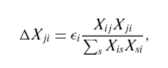
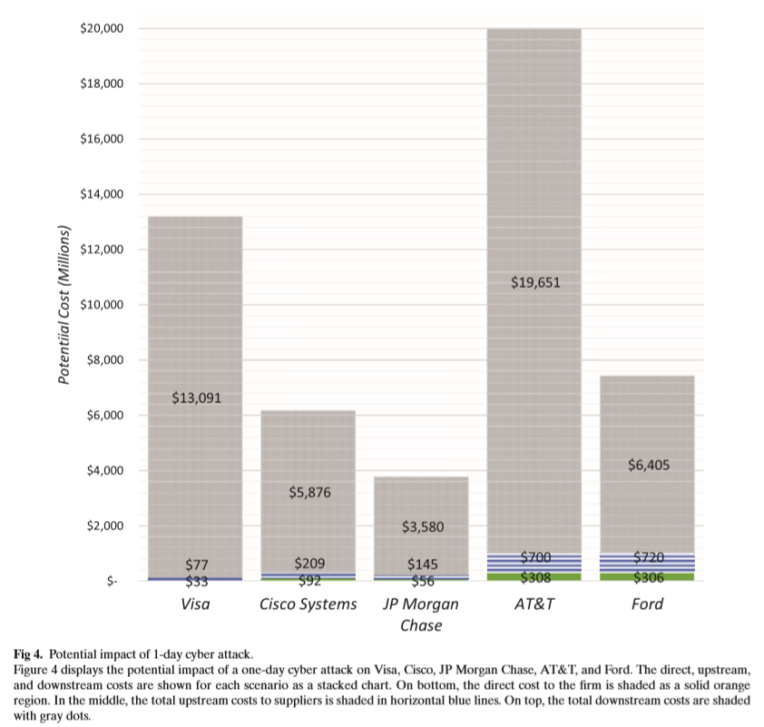
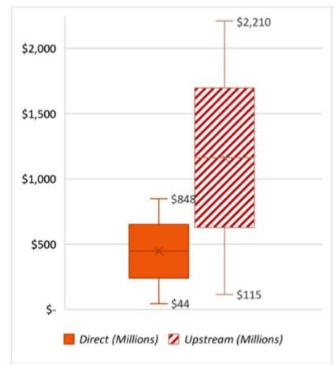
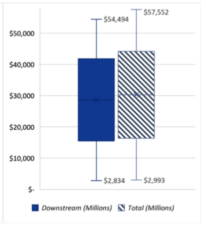
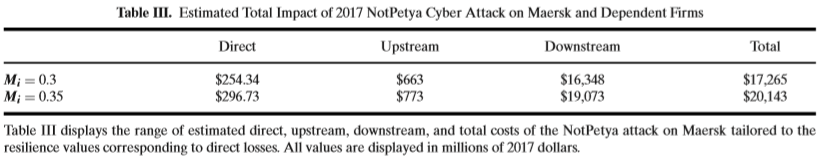

# Systemic Cyber Risk and Aggregate Impacts

> Title : Systemic Cyber Risk and Aggregate Impacts
>
> Authors : Jonathan W. Welburn, Aaron M. Strong
>
> Journal : Risk Analysis 2021

---

### 1. Introduction

### 2. Efforts to understand systemic cyber risk

- Systemic risk의 정의는 다음과 같음 (Bandt and Hartmann, 2000)
  - an event, where the release of 'bad news' about a financial institution, or even its failure, or the crash of a financial market leads in a sequential fashion to considerable adverse effects on one or several other financial institutions or markets
  - widespread systemic shock으로 인해 발생한 도미노 효과
  - 2008년의 글로벌 금융위기 때 systemic risk in finance에 대한 많은 연구가 이루어짐.
- 금융처럼, cyberspace도 네트워크 tie를 통한 inter-dependent한 조직의 시스템임
  - 따라서, 본 논문에서는 systemic risk + cyber risk하여 systemic cyber risk라는 용어를 만듦.
  - cyberspace의 시스템적 위험에 대한 연구는 사이버 보안, 금융, 경제학, 위험 분석 분야를 기반으로 하는 연구
- 본 논문에서의 용어
  - cyber incident: a loss of confidentiality, integrity, and availability of digital information and information systems
  - hacking: the act of causing a cyber incident
  - data breach: the loss and exposure of confidential data following a cyber incident
  - cyber attack: degradation, disruption, or corruption of digital information and information systems
- 본 논문에서 등장하는 cyber incident는 data breach와 cyber attack이다.
  - data breach: the 2017 cyber incident at Equifax.
  - cyber attack: Ukrainian power grid.

#### 2.1 Approaches for Characterizing Systemic Cyber Risk

- Systemic Cyber risk의 정의는 다음과 같음 (World Economic Forum, 2016)
  - Systemic cyber risk is the risk that a cyber event at an individual component of a critical infrastructure ecosystem will cause significant delay, denial, breakdown, disruption or loss, such that services are impacted not only in the originating component but consequences also cascade into related ecosystem components, resulting in significant adverse effects to public health or safety, economic security or national security.

- 11가지 시스템적 사이버 공격패턴을 분류하였음.
  - common mode/repeated attacks, common mode/scattershot attacks, common mode/pervasive attacks, rolling attacks, transitive attacks, cascading attacks, shared resource consumption attacks, critical function attacks, regional attacks, service dependency attacks, and coordinated supply chain attacks.

- 또한, systemic cyber incident의 잠재적 영향력에 대한 연구도 진행됨.
  - systemic cyber risk can be a source of systemic financial risk where a cyber event on systemically important firms could lead to substantial spillover effects, or outward propagations (Office of Financial Research, 2017)
  - OECD는 시스템적 사이버 사건들을 country level, 혹은 global level 수준으로 충격을 줄 수 있는 요인으로 인식하기 시작하였음. (Sommer & Brown, 2011)

#### 2.2 Approaches for Modeling the Economic Impact of Cyber Risk

- 사이버 리스크의 경제적 결과 모델링은 진화하는 분야이며 다양한 방식의 리스크분석기법이 활용되고 있음.
  - 사이버 위험 정량화하는데 복잡성으로 모델링하는데 어려움을 겪으며, 현재 사이버 사고로 인한 비용의 범위추정 관련 문헌은 매우 부족함.
  - VaR모형 분석 기법 및 사이버위험 가중치 모델을 이용하여 추정하는 방법이 많이 사용함.
  - 하지만 이러한 접근방식들은 관찰 편향으로 인해 어려움을 겪음.
  - incident 데이터로 연구한 여러 논문들이 있지만, 이러한 연구들은 일부 사고는 보고되지 않았을 가능성이 있기에 꼬리 위험을 과소평가할 위험이 존재함.
- 따라서 통계적 모델이 아닌 경제적 영향을 추정하는구조적 모델의 사용에 대한 연구도 있음. (Dreyer et al, 2018)
  -  시스템적 비용을 추정하기 위해 sector수준의 input-output 분석을 통해 backward linkages와 upstream 공급망 연결에 따른 영향력을 추정하였음.
  - 하지만 그 연구에서는 Downstream 비용이 Upstream 비용을 초과할 수 있음을 인정하며, Downstream 비용에 대한 연구의 필요성을 주장함.

#### 2.3 A Framework for Characterizing Systemic Cyber Risk

- 본 논문에서는 정의 기반으로 위험분석 및 경제학 개념을 활용하여 간결한 systemic cyber risk 모델링 프레임워크를 제안함.
  - 이때, systemic cyber risk는 세 가지 유형으로 나뉠 수 있음: cascading cyber failure, common cause cyber failures, independent cyber failures
- cascading cyber failures는 하나의 사이버 사건이 외부로 확산되어 발생하는 리스크를 말함.
  - 상호연결된 기업과 조직 전체에 도미노 효과를 일으킴.
  - 대표적으로 Dyn에 대한 DDoS 사이버 공격이 연쇄적 사이버장애로 이어지는 사례가 있음.
- common cause cyber failures는 하나의 cyber expliot이 여러 기업에서 유발되어 다수의 사이버 사고를 유발하는 것을 말함.
  - 여러 기업과 조직들의 공통된 취약점을 악용하여 동시에 수많은 사이버 사고를 일으킴.
  - 대표적으로 WannaCry 사이버공격이 소프트웨어 취약점을 파악한 후, 한번의 해킹으로 전세계 수천 대의 컴퓨터를 감염시킨 랜섬웨어 사례가 있음.
- independent cyber failures는 개별 기업 및 조직의 독립적인 취약점을 악용한 리스크를 말함.
  - 수많은 개별 사이버사고가 동시다발적으로 발생하여 시스템 장애를 일으킴.
  - 실제로 발생할 확률은 거의 없음.
- 따라서, cascading cyber failures와 common cause cyber failures가 대표적인 systemic cyber risk의 원인이 됨.
- 본 논문에서는 cascading cyber failures에 초점을 맞추어서 연구를 진행하였음.

### 3. Quantitative Model

Sector-specific 모델은 cascading failure로 인한 비용/결과를 설명하는데 부적절함. (Brenner et al, 2017)

- A 기업이 생산 네트워크 측면에서 어떤 기업들과 연결되어 있는지에 대한 데이터가 많이 존재하지 않기 때문.
- 이는 firm-level의 생산 네트워크에 대한 연구가 부족하기 때문임.
- 이러한 어려움으로 여러가지 challenge들이 있었음.

대표적인 사례로 CGE(Computable General Equilibrium) model 사용 예가 있음. 

- Carrera, Standardi, Bosello, & Mysiak, 2015; Rose, Oladosu, & Liao, 2007
- 본 연구에서는 기업 내 방해에 의한 경제적 영향력을 추정하려고 하였음.
- 하지만 firm-level의 생산 네트워크에 대한 데이터가 없어, 어떠한 사건으로 기업이 가격 변화에 맞춰 생산량을 통제하면 경제가 즉각적으로 균형으로 맞춘다는 가정을 하였음.
- 하지만 이는 틀린 가정임.

따라서, 본 논문에서는 Input-output 모델링을 사용함.

- 사이버 공격과 같은 특이한 shock으로 인한 경제적 영향력을 연구하고자 함.
- 원래 I/O 모델은 부문 별 변동에 따른 경제적 영향력을 조사하는데 사용되었음 (Leontief, 1966)

전통적인 I/O 모델은 downstream 영향력을 고려하지 않음.

- Upstream impact는 공급망이나 프로세스의 이전 단계에서 발생한 변화로 인해 downstream에 영향을 줌. 반면 Downstream impact는 공급망이나 프로세스의 이후 단계에서 발생한 변화로 인해 upstream에 영향을 줌.
- CGE분석은 가격의 변화 (어떠한 결정)로부터 발생되는 공급망의 영향력을 분석하였음.

기업은 운영유지 및 사이버 공격으로부터 회복하기 위한 다양한 복원력이 존재함.

- 따라서, short run에 대하여 I/O 모델을 사용하고, long run에 대하여 CGE 모델링을 사용함하면 기업의 복원력을 허용할 수 있게 되고, 복원력은 cyber maturity부터 비즈니스 성격에 이르기까지 다양한 요인에 따라 달라질 수 있음.
- 이때 이러한 요인들이 뭔지 정확하게 모르고, 복원의 방식이 정적이냐 동적이냐에 따라 달라진다는 것을 고려해보면, 개개인의 기업들의 복원력을 추정하는 것은 딱히 중요하지 않을 수 있음.
- 그럼에도 Rose et al, 2007에서는 경제적 부분 수준에서 바라본 기업들의 평균 복원력을 추정하는 연구를 진행하였으며, 테러 공격으로 인해 정전이 발생했을 때 기업들의 복원력을 조사함.
- 그러므로 본 논문에서는 각각 기업에서의 사이버 사건으로 인한 잠재적 영향력을 추정하기 위한 전통적인 I/O 모델링을 구현하기 위해 structural model을 정의하고자 함.

3장에서는 quantitative 모델을 이용하여 사이버 사건으로 인한 잠재적 경제적 결과를 추정하였음.

- 경제적 결과는 경제 전반에 걸친 매출 손실의 관점에서의 결과이며, 이는 사이버 공격을 받음으로써 발생한 결과임.
- 이를 통해, 본 논문에서는 business interruption이 기업의 생산량과 수익에 대한 영향력을 최소화하는 기업 수준의 복원력을 통합하였음.

#### 3.1 Cyber attack Foundations of Idiosyncratic Firm Risk

- cyber attack으로 발생한 기업 내 정전으로 인한 aggregate impact를 이해하기 위해, 본 논문에서는 다음과 같이 economy를 모델링하였음: $\varepsilon = \{S, W,  \epsilon\}$
  - $\varepsilon$ : economy, $S$: sector type, $W$ : weighted adjacency matrix, $\epsilon$ : a vector of sector-level shocks
  - 각각의 sector $S$에서, 
  - 기업 $f$에서의 생산량은 $y_f$이며, $i$ sector에서의 총 산출물 양은 $Y_i = \Sigma_{f \in i} y_f$로 계산함.
  - 총 합계 산출물 양 $Y$는 모든 기업들의 산출물 양을 합하여 $Y=\Sigma_{f}^{m} y_f$로 계산함.
- $\varepsilon$를 모델링하기 위해 본 논문에서는 충격 벡터인 $\epsilon$의 근원을 micro하게 분석하고자 함 (foundations of microorigins).
- 이러한 접근법은 **Assumption 1**을 기반으로 진행됨
  - ***Assumption 1***: 각 sector의 유입/유출량이 그 sector 내 기업들을 대표하며, 모든 기업들의 생산과정은 동일하다고 가정한다: $u_{fj}=\omega_{fi}w_{ij}$
  - $w_{ij}$: sector $i$에서 생산된 물품들이 sector $j$로 유입되는 양
  - $\omega_{fi}$: sector $i$에서 산출되는 전체 양 대비, 기업 $f$에서 생산한 물품들 비율
  - $u_{fj}$: sector $j$로 유입되는 품목들의 양 대비, 기업 $f$에서 생산한 품목들 비율
  - 위 Assumption 1은 실생활에서는 허용되지는 못하지만, 이를 통해 기업 수준에서의 shock으로 인한 총합 손실을 구할 수 있다는 점에서 의의가 있음.
- 기업 수준에서의 shock인 $\phi_f$로 sector수준에서의 shock인 $\epsilon_i$를 설명할 수 있음: $\epsilon_i = \phi^` \omega_i$.
  - $\omega_i$: sector $i$에 속하는 총 m개의 기업들의 생산량 점유율 벡터
  - $\phi^`$: sector $i$에 속하는 총 m개의 기업들의 shock벡터
- 그리고 $\phi_f$는 cyber-attack이 지속된 기간에 비례하여 다음과 같이 계산: $\phi_f=(\frac{y_f}{365})M_f \Lambda$
  - $\frac{y_f}{365}$: 기업$f$의 평균 일일 소득
  - $M_f$: sector resilience multiplier
  - $M_f=0$이면 기업 $f$는 shock을 완전히 받지 않았음을 의미하며, $M_f=1$이면 entirety of shock를 받았음을 의미함.
  - $M_f$는 estimated by a model calibrated to the effects of a power outage.
- 기업 수준에서의 실제 생산 네트워크에 대한 데이터는 없기 때문에, 본 연구에서는 각 기업이 소속 sector를 대표한다고 가정하여 표준 입출력 분석을 사용하였음. 이때 **Assumption 2**를 진행함.
  - ***Assumption 2***: 공격으로 영향받는 기간은 충분히 짧다고 가정한다. 네트워크 관계를 고정적으로 유지하는 비즈니스 관계의 재계약을 허용하지 않음.
  - 따라서, 혼란이 발생하는 경우에 일반 균형모델이 아닌 I/O 모델에 포함된 완전 보완가정을 기반으로 사이버공격으로 인한 혼란을 고려하였음.

#### 3.2 Upstream Impacts

- 우선 traditional I/O 모델에 대해서 설명이 필요.
- 전통적인 I/O 모델은 내적을 통해 경제 내 backward linkages 또는 upstream supply chain linkages를 추정함: $\mathbf{x}=\mathbf{W}\mathbf{x}+d$
  - $\mathbf{W}$ : sector 내에서 weighted adjacency matrix
  - $\mathbf{x}$ : sector level output vector
  - $d$ : sector level demand vector
- 그리고 위 식은 다음과 같이 변환 가능함: $\mathbf{x}=(I-\mathbf{W})^{-1}d=\mathbf{L}^{-1}d$
  - $\mathbf{L}^{-1}$은 inverse Leontief 행렬
  - 생산량 변화와 관련된 간접효과 및 Upstream 상호작용을 통해 다른 sector에 미치는 영향을 의미함.
- 이 과정을 토대로 $d$대신 shock 지수인 $\epsilon$을 사용하여 aggregate upstream impact를 계산할 수 있음
  - $\Delta \mathbf{x}=\mathbf{L}^{-1}\epsilon$

#### 3.3 Downstream Impacts

- 기업은 물품의 제공자이면서 구매자이기도 하듯이, shock은 upstream 뿐만 아니라 downstream에도 영향을 줌.
  - downstream에서의 영향력을 분석하고자, 영향받는 sector를 인식해야하며, 이는 NAICS (North American Industry Classification System)을 기반으로 진행하였음.
  - 이를 통해 한 기업의 shock으로 인한 output 감소가 다른 sector들의 input에 얼마나 영향을 주는지 확인하고자 함.
- shock $\epsilon$으로인한 $Y_i$의 감소로 sector $j$로 들어가는 생산품들의 양을 $X_{ji}$라고 정의함.
  - allocate the lost output to each of the sectors
  - $\Delta X_{ji}$는 $\epsilon$과 percentage of sector $i$'s inputs to production from sector $j$의 곱과 같음.
  - 
  - $\Delta X_{ji}$는 sector $j$에서의 output인 $Y_j$에 영향을 줌.
- 결론적으로, 각각의 sector들은 cascading shock을 겪게 되는데, 이는 economy 내 기업 $f$의 중요도로 볼 수 있음.
- 따라서, 한 기업이 해당 부문 내 중요한 경우, 전체 경제에 큰 영향을 미칠 수 있음.

### 4. Cyber Incident Analysis

#### 4.1 Analysis of Potential Incidents

- cyber attack으로 인한 잠재적 영향력을 분석해보고자 함.

  - 실제 기업들을 대상으로 진행 (AT&T, Cisco, JP Morgan Chase, Visa + Ford)
  - 
  - 각 기업들의 revenue, sector, duration, resilience 지수를 추출.
  - 본 연구의 목적은 각 기업들의 잠재적 손실을 추정하는 것.
  - 기업들은 자기들만의 복원력 및 리스크 관리전략이 있기 때문에, 실제 손실과 비교했을 때 추정한 잠재적 손실값이 더 높게 나올 수 있음.

- 하루 동안 direct 영향력은 기업의 revenue에 비례함.

  - $\phi_f=(\frac{y_f}{365})M_f \Lambda$에 근거하여 계산하므로..

- 하지만 systemic cyber failure는 다른 양상을 가짐.

- Upstream impact는 direct를 초과할 수 있음.

  - | Firm      | Direct cost           | Upstream impact |
    | --------- | --------------------- | --------------- |
    | Visa      | 33 million            | 77 million      |
    | Cisco     | 92 million            | 209 million     |
    | JP Morgan | 56 million            | 145 million     |
    | AT&T      | more than 300 million | 700 million     |
    | Ford      | more than 300 million | 706 million     |

- Downstream도 cyber attack의 영향이 각 기업에서 고객으로 전파되는 사실이 반영됨.

  - AT&T는 제일 큰 회사로, 가장 큰 downstream 영향력을 가짐.
  - 

- 4개 기업들 대상으로 하루 동안의 사이버공격에 따른 손실추정 결과, systemic cyber risk의 잠재적 영향력이 매우 큼을 알 수 있음.

  - 각각의 회사에서 발생한 손실 (direct cost)는 manageable함.
  - 하지만 이로 인한 cascading impact는 매우 큰 손실을 입힐 수 있음.
  - AT&T의 손실은 거의 20억달러이며, 이는 2017년 미국 gross domestic product의  0.1%에 해당하는 수치임.

- Direct impact와 systemic impact간의 차이는 firm의 유형, sector, 기업 간 상호연결 정도에 따라 달라짐.

  - Ford 회사는 중간품보다 완제품을 제조하는 회사이므로, downstream cost비율이 비교적 낮음을 알 수 있음.

#### 4.2 Maersk Case

- 2017년 NotPetya 사이버공격으로 피해를 입은 Maersk의 실제 사례를 가지고 비교분석을 하고자 함.
  - 공격을 받은 시점부터 rebuild되는 시점까지 총 10일이라는 시간이 걸림.
  - 수익 측면에서 Maersk는 250~300billion 달러의 손실을 입었다고 함.
- 앞서 3장에서 소개한 quantitative model을 이용하여 Marks outage와 이로 인한 잠재적 손실을 추정하고자 함.
  - 하지만 Maersk 기업의 실제 resilience를 모름.
  - 따라서 잠재적 손실의 정확한 값이 아닌, 범위를 추정하고자 함.
  - Rose et al에서 제시한 transportation sector일 때 $M_f$값인 0.052부터 1사이의 값들을 바탕으로, 표2의 값을 이용하여 잠재적 영향의 범위를 측정하였음.
- Direct impact와 upstream impact의 측정 범위는 다음과 같음.
  -  
  -  Direct 손실은 44~848 billion 달러 사이로 추정됨.
  -  Upstream 손실은 115 million ~ 2.2 billion 달러 사이로 추정됨.
  -  즉, 복원력 수치에 따라 크게 달라지는 것을 확인할 수 있음.
- 이때, Direct impact 손실의 범위는 상대적으로 narrow함.
  - 실제 값은 250~300million 사이임.
  - 계산한 값과 실제값이 차이가 좀 있다는 것을 확인할 수 있음.
  - Sector 내에서 기업의 이질성이 존재하므로, 상이한 변동이 발생할 수 있기 때문에 각각 기업의 resilience를 추정하는 것이 중요해보임.
- Downstream impact과 total impact의 측정 범위는 다음과 같음.
  - 
  - Downstream 손실은 2.8~54 billion 달러 사이로 추정됨.
  - Total 손실은 3~58 billion 달러 사이로 추정됨.
  - 추정치 상단은 $M_f$값이 낮아 현저히 높지만, 하단은 그럼에도 불구하고 Maersk의 잠재적 영향이 총 비용에 상대적으로 영향을 주었음을 알 수 있음. (?)
- 실제 사례를 바탕으로 total loss를 추정할 수도 있음.
  - Maersk기업의 actual loss는 250~300 billion달러 사이이며, 이는 $M_F$값이 0.3에서 0.35 사이임을 알 수 있음. 이를 통해 나온 결과는 다음과 같음.
  - 
  - 따라서 actual cost가 300million로 추정되는 경우 total cost는 20 billion달러까지의 시스템적 피해를 유발시킬 수 있음을 확인할 수 있음.
- 기간과 복원력을 둘러싼 불확실성을 고려할 때, 철저한 검증을 할 수는 없지만 잠재적인 사이버공격 영향을 추정하는데 있어서 역량을 보임.
  - Maersk기업 분석은 머스크의 보고서와 일치하는 동시에 인사이트를 제공함.

### 5. Implications for Cyber Insurance and Cyber Policy 

- 본 연구에서 systemic cyber failure로 인한 잠재적 손실을 추정하는데의 동기는 아래 질문에 대한 대답임.
  - 사이버보험이 사이버리스크를 관리하는데 충분한가?
  - 시스템적 사이버리스크 관리를 위한 사이버 정책 논의가 필요한가?
- 많은 보험사는 사이버 보험 정책을 만들 때 보안 관련 질문과 포트폴리오 다각화를 통해 포트폴리오 위험을 관리함.
  - 다양한 정책에서 수집하는 광범위한 보안정보와 해당정보가 보험 가격에 통합되는 방식이 다양하다는 사실이 발견됨.
  - 또한, systemic failure를 초래할 수 있는 기업의 특성을 파악하여, 다각화의 암묵적인 가정인 독립성을 약화시키고 치명적인 손실을 초래할 수 있는 가능성을 파악해야함.
- 현재, 매우 작은 기업들도 aggregation risk를 이해하고 예측하기 위해 데이터 모델링 기법들을 다양하게 연구하고 있음.
  - Cambridge Center for Risk Studies and Risk Management Solutions: 사이버 사건들로부터 수집되는 정보들을 표준화시키기 위해 Cyber Accumulation Management System을 구축함.
  - 또한, AIR 리스크 모델링 회사는 2016년 경쟁 프레임워크를 제공하는 사이버 노출 데이터 표준을 개발하였음.
- 보험사는 생각보다 systemic risk cover위험에 많이 노출되어있음.
  - Direct 손실은 여러 보험사로의 분산으로 노출을 줄일 수 있음.
  - 하지만 Upstream, Downstream impact는 동시다발적인 보험 손실로 인해 hidden portfolio risk가 발생할 수 있음.
- 하지만 다운스트림 손실을 포함한 비용을 보면 광범위한 정책 논의의 필요성을 볼 수 있음.
  - 1일 동안의 정전 사태, 그리고 우크라이나 사례의 잠재적 영향은 본 연구에서 제시한 시나리오를 초과할 수 있음.
  - Systemic cyber risk의 민간 부문에 대한 영향력을 고려했을 때, 추가적인 정책적 고려가 필요함.
  - 또한, 복원력 강화가 systemic cyber risk 대체요인 중 하나가 될 수 있기 때문에 복원력 강화를 위한 노력도 필요함.